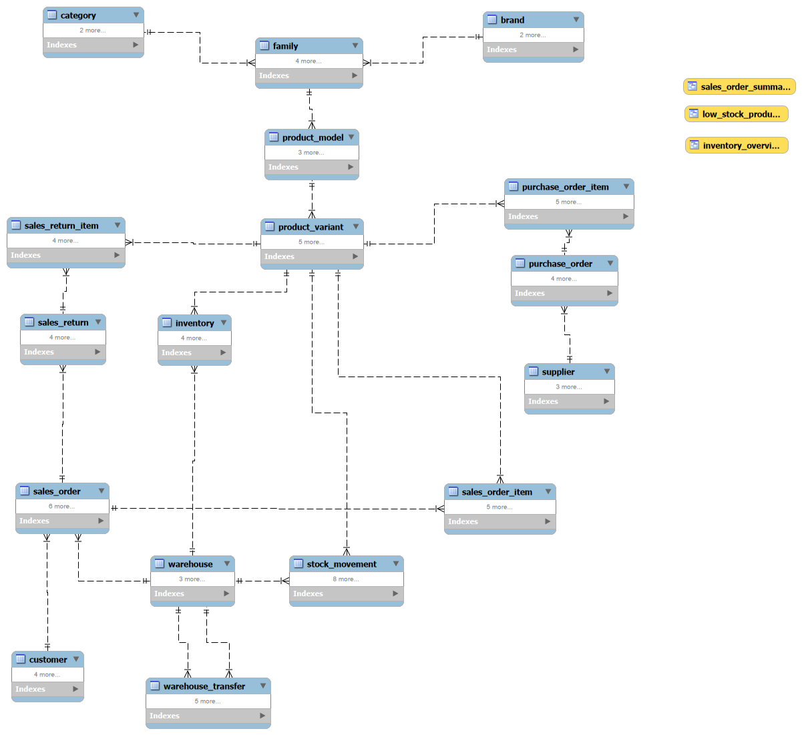

# SupplyCore MySQL

SupplyCore stok, satınalma və satış proseslərini bir verilənlər bazası daxilində idarə etmək üçün hazırladığım MySQL layihəsidir.

Layihəni qurarkən əsas diqqəti data consistency, stok dəyişikliklərinin təhlükəsiz aparılması və əsas business əməliyyatlarının database səviyyəsində idarə olunmasına vermişəm.

## Əsas imkanlar

- Məhsullar üçün category, brand, family, model və variant strukturu
- Bir neçə anbar üzrə inventory idarəetməsi
- Təchizatçı və purchase order prosesi
- Müştəri və sales order idarəetməsi
- Sales return prosesi
- Anbarlararası stok transferi
- Stock movement history
- Reporting üçün VIEW-lar
- Business analytics query-ləri
- Query performansı üçün index-lər
- Role-based database access

## ER Diagram

## Database strukturu

Layihə əsasən aşağıdakı hissələrdən ibarətdir:

- Product catalog
- Warehouse və inventory
- Suppliers və purchasing
- Customers və sales
- Sales returns
- Warehouse transfers
- Stock movement history

## Əsas business qaydaları

Stok yalnız təsdiqlənmiş əməliyyatlar zamanı dəyişir.

- Sales order `DRAFT` vəziyyətində stokdan məhsul çıxılmır.
- Order təsdiqlənərkən kifayət qədər stok olub-olmadığı yoxlanılır.
- Purchase order qəbul ediləndə inventory artır.
- Warehouse transfer zamanı stok bir anbardan azalır, digər anbarda artır.
- Sales return zamanı əvvəlki qaytarmalar nəzərə alınır və satılmış quantity-dən artıq məhsul qaytarmaq mümkün deyil.
- Bütün əsas stok dəyişiklikləri `stock_movement` table-ında qeyd olunur.

## Stored Procedures

Əsas əməliyyatlar stored procedure-lər vasitəsilə idarə olunur:

- `confirm_sales_order`
- `receive_purchase_order`
- `transfer_stock`
- `return_sales_item`

Procedure-lərdə transaction, rollback və row locking istifadə olunur ki, stok dəyişiklikləri yarımçıq vəziyyətdə qalmasın.

## VIEW-lar

Reporting və məlumatların daha rahat oxunması üçün:

- `inventory_overview`
- `sales_order_summary`
- `low_stock_products`

## Analytics

`07_analytics.sql` faylında aşağıdakı query-lər var:

- aylıq satış gəliri
- ən çox satılan məhsullar
- brand üzrə satış nəticələri
- average order value
- warehouse stock distribution
- aylıq revenue growth

Monthly revenue growth query-sində CTE və `LAG()` window function istifadə olunur.

## Indexing

Əlavə index-lər real query pattern-lərinə əsasən yaradılıb:

- sales reporting üçün `(status, confirmed_at)`
- stock movement lookup üçün `(reference_type, reference_id)`
- məhsulun movement history-si üçün `(variant_id, created_at)`

Primary key və UNIQUE constraint-lərin yaratdığı index-lər ayrıca təkrarlanmayıb.

## Security

Database access 3 role ilə ayrılıb:

- `supplycore_admin`
- `supplycore_app`
- `supplycore_analyst`

Application role kritik inventory table-larını birbaşa dəyişmək əvəzinə əsas stok əməliyyatlarını stored procedure-lər vasitəsilə yerinə yetirir.

## SQL faylları

| Fayl | Təyinat |
|------|---------|
| `01_schema.sql` | Table-lar və əlaqələr |
| `02_seed_data.sql` | İlkin nümunə data |
| `03_business_rules.sql` | CHECK constraint-lər və business qaydaları |
| `04_views.sql` | Reporting VIEW-ları |
| `05_procedures.sql` | Əsas transaction və stok əməliyyatları |
| `07_analytics.sql` | Analytics query-ləri |
| `08_indexes.sql` | Query performansı üçün index-lər |
| `09_security.sql` | Role və privilege-lər |

## Setup

SQL fayllarını aşağıdakı ardıcıllıqla run etmək lazımdır:

1. `01_schema.sql`
2. `02_seed_data.sql`
3. `03_business_rules.sql`
4. `04_views.sql`
5. `05_procedures.sql`
6. `08_indexes.sql`
7. `09_security.sql`

`07_analytics.sql` database qurulduqdan sonra ayrıca run edilə bilər.

## Texnologiyalar

- MySQL 8
- MySQL Workbench
- SQL
- Git
- GitHub